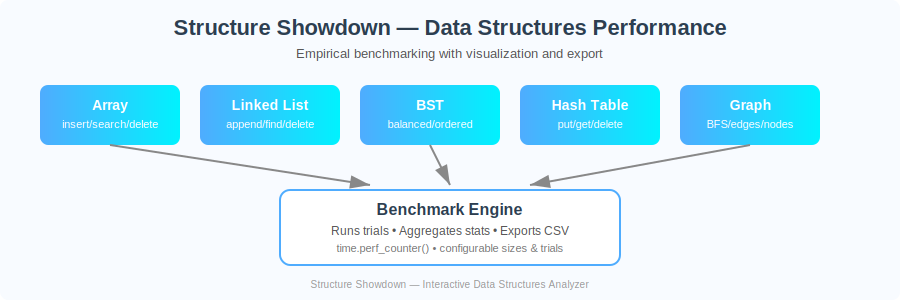

# 🧱 Structure Showdown: Performance Analysis and Comparison of Data Structures


> Empirical performance analysis and comparison of fundamental data structures across diverse operations.

<!-- Image gallery: overview + screenshots -->
<p align="center">
    
</p>

<p align="center">
    
    
</p>

<p align="center">
    
    
    
</p>

## 🎯 Project Overview

**Structure Showdown** is an interactive educational tool that helps you understand data structure trade-offs through empirical benchmarking. Analyze and compare arrays, linked lists, trees, hash tables, and graphs for operations like insertion, deletion, and search using a beautiful Streamlit interface.

### Domain
- **Algorithms & Data Structures**
- **Performance Analysis**
- **Empirical Complexity Verification**

### Objectives
- 📊 Understand trade-offs between data structures for different scenarios
- 🔬 Empirically verify Big-O complexity through measurement
- 💡 Make informed decisions on choosing appropriate data structures
- 📈 Visualize performance scaling with input size

## ✨ Features

- **5 Data Structures**: Arrays (Python list), Linked Lists, Binary Search Tree, Hash Tables, Graphs
- **17 Operations**: Comprehensive coverage of insertion, deletion, and search operations
- **Statistical Analysis**: Mean, median, standard deviation, min/max with visual representations
- **Interactive Visualization**: Line charts, bar charts, and heatmaps
- **Export Capabilities**: Download results as CSV for external analysis
- **Educational Content**: Big-O reference tables and trade-off explanations
- **Customizable Benchmarks**: Configure input sizes, trials, and operation types
- **Responsive UI**: Clean, modern interface built with Streamlit

## 🚀 Quick Start

### Prerequisites
- Python 3.8 or higher
- pip package manager

### Installation & Running

#### Windows PowerShell
```powershell
# 1) Navigate to project directory
cd "d:\harsh\Documents\mini\daa project"

# 2) Create and activate virtual environment
python -m venv .venv
.\.venv\Scripts\Activate.ps1

# 3) Install dependencies
pip install -r requirements.txt

# 4) Run the application
streamlit run app.py
```

#### Linux/macOS
```bash
# 1) Navigate to project directory
cd ~/daa-project

# 2) Create and activate virtual environment
python3 -m venv .venv
source .venv/bin/activate

# 3) Install dependencies
pip install -r requirements.txt

# 4) Run the application
streamlit run app.py
```

The app will automatically open in your browser at `http://localhost:8501`

## 📁 Project Structure

```
daa-project/
├── app.py                          # Main Streamlit application
├── requirements.txt                # Python dependencies
├── README.md                       # This file
├── .gitignore                      # Git ignore rules
├── src/
│   ├── ds/                         # Data structure implementations
│   │   ├── __init__.py
│   │   ├── array_ds.py            # Array wrapper
│   │   ├── linked_list.py         # Singly linked list
│   │   ├── bst.py                 # Binary search tree
│   │   ├── hash_table.py          # Hash table (separate chaining)
│   │   └── graph.py               # Graph (adjacency list)
│   ├── benchmarks/
│   │   └── benchmark.py           # Benchmarking harness
│   └── utils/
│       └── __init__.py
└── tests/
    └── smoke_test.py              # Basic correctness tests
```

## 🎮 Usage Guide

### Running Benchmarks

1. **Launch the application**: Run `streamlit run app.py`
2. **Select an operation** from the sidebar dropdown (e.g., "Array: insert_end")
3. **Choose size configuration**:
   - Small (100-1K): Quick tests for development
   - Medium (1K-10K): Balanced performance analysis
   - Large (10K-50K): Stress testing
   - Custom: Define your own range
4. **Set number of trials**: More trials = better statistical significance
5. **Click "🚀 Run Benchmark"** and wait for results

### Interpreting Results

The application provides 4 tabs:

#### 📊 Visualization
- Line chart showing mean execution time vs input size
- Bar chart displaying min/mean/max range

#### 📈 Statistics
- Complete statistical summary table
- Overall metrics: average time, growth factor, coefficient of variation
- Color-coded performance heatmap

#### 🔢 Raw Data
- All individual trial measurements
- Export options for raw and aggregated data

#### 💡 Insights
- Operation-specific analysis and recommendations
- Big-O complexity reference
- Trade-offs cheat sheet comparing all structures

## 📊 Supported Operations

### Arrays (Python list)
- `insert_end`: Append to end (O(1) amortized)
- `insert_front`: Insert at beginning (O(n))
- `search`: Linear search (O(n))
- `delete`: Remove element (O(n))

### Linked List
- `insert_tail`: Append to tail (O(n))
- `search`: Find element (O(n))
- `delete`: Remove element (O(n))

### Binary Search Tree
- `insert`: Random insertion (O(log n) avg)
- `insert_ordered`: Ordered insertion - worst case (O(n))
- `search`: Find element (O(log n) avg)
- `delete`: Remove node (O(log n) avg)

### Hash Table
- `put`: Insert key-value pair (O(1) avg)
- `get`: Retrieve value by key (O(1) avg)
- `delete`: Remove entry (O(1) avg)

### Graph (Adjacency List)
- `add_edges`: Add edges in linear chain (O(1) per edge)
- `bfs_search`: Breadth-first search (O(V + E))
- `delete_node`: Remove node (O(degree))

## 🔬 Technical Details

### Benchmarking Methodology
- Uses `time.perf_counter()` for high-resolution timing
- Multiple trials per configuration for statistical reliability
- Fresh data structure instances for each trial
- Randomized input for average-case analysis (except ordered tests)

### Data Structure Implementations
All implementations are custom-built for educational purposes:
- **Array**: Wrapper around Python list
- **Linked List**: Singly-linked with head pointer
- **BST**: Unbalanced binary search tree
- **Hash Table**: Separate chaining with configurable capacity
- **Graph**: Adjacency list representation (undirected)

## 📚 Learning Outcomes

By using this tool, you will:

1. **Understand Big-O notation** through empirical verification
2. **Recognize trade-offs** between space and time complexity
3. **Make informed choices** about which data structure to use
4. **Visualize performance** characteristics across input sizes
5. **Appreciate implementation details** that affect real-world performance

## 🤝 Contributing

Suggestions for improvement:
- Add more data structures (AVL tree, Red-Black tree, Heap, Trie)
- Implement additional operations (merge, split, traversals)
- Add memory profiling alongside time measurements
- Create comparison mode (benchmark multiple structures simultaneously)
- Add unit tests and CI/CD pipeline

## 📄 License

This is an educational project created for learning purposes.

## 🎓 Academic Use

Perfect for:
- Algorithm and Data Structure courses
- Performance analysis assignments
- Computer Science projects
- Self-study and experimentation

## 🐛 Troubleshooting

**Issue**: ModuleNotFoundError  
**Solution**: Make sure you're in the project directory and virtual environment is activated

**Issue**: Streamlit not found  
**Solution**: Run `pip install -r requirements.txt` in activated venv

**Issue**: Benchmark takes too long  
**Solution**: Reduce input sizes or number of trials, use "Small" preset

**Issue**: Memory error with large inputs  
**Solution**: Lower the max size, especially for O(n²) operations

## 📞 Support

For issues or questions:
1. Check the troubleshooting section above
2. Review the code documentation in source files
3. Experiment with smaller input sizes first

---

**Made with ❤️ using Python and Streamlit**
